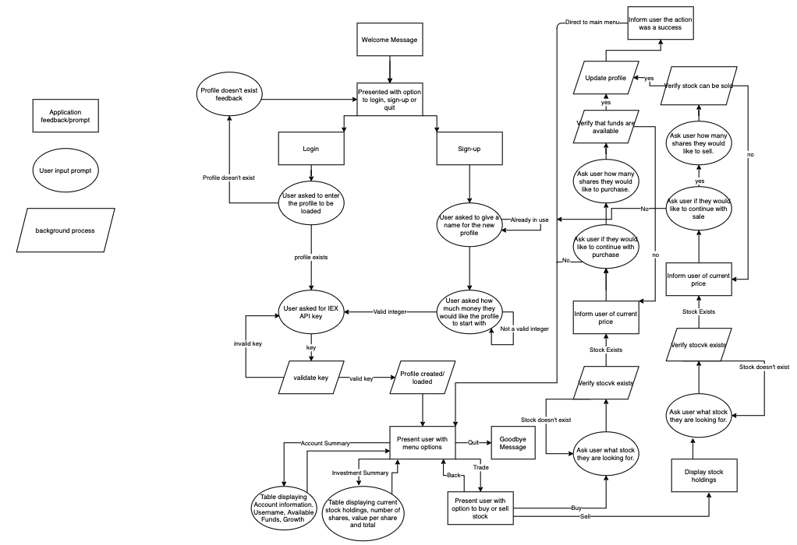

# Christopher Baker - T1A3 Terminal Application

## Description
This application is a finance application designed to help people who wish to learn more about trading on a stock market. It allows users to:

1. Create a profile to trade with
2. View Account/Investment summaries
3. Execute trades


## R4 - Repository
---
Repository:
https://github.com/ChrisBaker-dev/TerminalApplication

Trello: 
https://trello.com/b/rACuCMep/chris-finance-app

## R5 - Purpose and Scope
---
## What will this application do?
This application will allow people to create a profile and allot a sum of money to invest with. The user will then begin trading in their desired stocks and can track their profiles growth and stock values over time.

## What problem am I solving and why develop it?
I created this software for a couple reasons. First, understanding the stock market and executing trades can seem daunting at first glance. This application aims to allow people to learn without financial risk or, for those who are looking to test new investment strategies, test those strategies without risk. 

## Target Audience
This application is intended for anyone who wishes to learn more about trading and the financial world. You will be able to implement your own trading techniques, track your own growth and learn about the financial market. There is no required investment for this application, you will be trading fake money.

## How to use
First, you must install all the requried Ruby gems. Please see the installation guide in this document.

Second, you must go to the IEX website (link provided) and create a free or paid account to receive an API key in order to access financial data.

Now you are ready to load the application.
Upon loading the application, you will be able to select from already created profiles or create your own from scratch. Next, you will give yourself a sum of money in order to trade with.

From there, your trading journey will begin. I'd recommend looking through the various menus and selecting the help option to guide you through what they accomplish.

## R6 - Features
---
This applications comes with three main features:
1. Profile Creation
2. Execution of trades (buy/sell)
3. Profile/Investment summaries

### Profile Creation
**Profile creation** is important to the user because it allows them to track their performance over time. It also allows the user to test various investment techniques and save them individually so they can better understand the upsides or downsides. The user will decide upon launching the application to either load a profile or create a new one.

The profile creation will loop through the saved JSON file in order to ensure a profile being loaded exists or a file being created does not already exist. If errors are encountered, the user will be asked for a new input.

### Execution of trades (Buy/Sell)
**Trade Execution** is mandatory to the MVP of my financial application. This allows the user to look at current stocks in real time and make trades for their profile. In order for this to work, we need to handle a variety of errors. This includes:
- Validate API Key
- Validate stock ticker
- Validate there are enough funds to make a trade
- If selling, validate the stock exists in the profile

Following the checks, we can update the profile information and give the user feedback on the success of the action.

### Profile/Investment Summaries
**Profile and Investment Summaries** are important to the MVP because it is a feature that will allow the user to learn using the application. They will be able to understand what investment investment strategies are working using these feedback tools.

In order to ensure these features work, I will have to parse hashes/lists, utilize the profile class and handle errors reguarding empty data structures.

## R7 -Development Outline - User Interaction/Experience
---

### Profile Creation
**Profile creation** will be prompted to the user on startup. They will be able to select between logging into an existing profile or create a new one. The user will receive feedback from the application on what steps they can make, and if errors are beiung encountered, they will be displayed to the user and ask for a new input.

### Execution of trades (Buy/Sell)
**Trade Execution** is shown to the user in the form of a prompt after they have successfully joined with a profile. The user will follow the following steps:
1. The user will be able to arrow down to "Make Trade" which will direct them to another prompt "Buy, Sell or Back". 
2. Upon selecting "Buy or Sell", the user will be asked for a stock they wish to make an action on. My program will check the existance of this stock, if it does not exist, the user will be asked for another stock or if they would like to quit this process. The option sell also provides the user with a table of their current investments so they know what stocks they have and how many. 
3. Upon selecting a valid stock, the program will advice the user of the current price and ask them how many shares they would like to perform an action on.
4. The application will handle various errors at this point including, insufficient funds for purchasing or trying to sell too many stocks that you do not own.
5. Upon success, the user will be notified of their success, what action just took place and their profile will be updated.
6. The user is then brought back to the main menu.

### Profile/Investment Summaries
**Profile and Investment Summaries** are prompted to the user from the main menu. 
1. Upon selecting "Account Summary", the user will be displayed a table with their username, available funds to trade with and their growth. The growth percentage has received updated stock values from their holdings and calculated it into the percentage. The user is then redirected to the main menu.
2. The investment summary also provides the user with a table containing their Stock, number of shares, current price of the stock, and total value of the holding. After this information has been displayed, the user is redirected to the main menu.

## R8 - Control Flow Diagram


## R9 - Implementation Plan
### Profile Creation
Checklist
1. Create a profile class to store data
- Approximation of time needed to complete: 1 hours. Deadline: Wednesday April 7, 2021. Priority: HIGH.
2. Create data structures to manage data
- Approximation of time needed to complete: 2 hours. Deadline: Wednesday April 7, 2021. Priority: HIGH.
3. Update profile class dependent on user purchasing actions
- Approximation of time needed to complete:  6 hours. Deadline: Thursday April 8, 2021. Priority: HIGH.
4. Read and write to JSON file
- Approximation of time needed to complete: 4 hours. Deadline: Wednesday April 7, 2021. Priority: HIGH.
5. Error Handling
- Approximation of time needed to complete: 3 hours. Deadline: Saturday April 10, 2021. Priority: HIGH.

### Execution of Trades (Buy/Sell)
Checklist
1. Create Stock class to manage data on the stock to trade
- Approximation of time needed to complete: 1 hours. Deadline: Thursday April 8, 2021. Priority: HIGH.
2. Connect communications with IEX API
    - Ensure key is valid
    - Get up to date stock information
- Approximation of time needed to complete: 2 hours. Deadline: Saturday April 10, 2021. Priority: HIGH.

3. Give feedback to user reguarding current prices
- Approximation of time needed to complete: 1 hours. Deadline: Saturday April 10, 2021. Priority: HIGH.

4. Process trade
    - Validate trade
    - Update profile data
    - Feedback to user
- Approximation of time needed to complete: 2 hours. Deadline: Saturday April 10, 2021. Priority: HIGH.

5. Error Handling
- Approximation of time needed to complete: 3 hours. Deadline: Sunday April 11, 2021. Priority: HIGH.

### Profile/Investment Summaries
Checklist
1. Update data to be displayed 
- Approximation of time needed to complete: 2 hours. Deadline: Friday April 9, 2021. Priority: HIGH.

2. Create tables to display to user

 Approximation of time needed to complete: 1 hour. Deadline Friday April 9, 2021. Priority: HIGH.

3. Make calculations to display to user

Information needs to be calculated in order to get a proper summary. For example, all stock values need to be checked against their current values in order to see how much growth our profile has made. 
- Approximation of time needed to complete: 1 hour. Deadline Friday April 9, 2021. Priority: HIGH.

4. Utilize tty-table to format
- Approximation of time needed to complete: 1 hours. Deadline: Friday April 9, 2021. Priority: HIGH.


5. Test outputs are correct

Testing is required to make sure tables are being generated properly. Handle exceptions for tables trying to be generated when no trades have been made. 

- Approximation of time needed to complete: 3 hours. Deadline: Saturday April 11, 2021. Priority: HIGH.


# R10 - Installation

Download and install Ruby onto your computer. Instructions on how to do so can be found here: [Ruby installation guide](https://www.ruby-lang.org/en/documentation/installation/ "Ruby installation")

Run this command in your terminal:
```
sh -c "$(curl -fsSL https://raw.githubusercontent.com/ChrisBaker-dev/TerminalApplication/main/src/install.sh)"
```

**If you are having issues with this command you may need to check your gem paths**

### Hardware Requirements
This application should run on all platforms. No known hardware requirements.

## How to get an IEX API Key

1. Go to https://iexcloud.io/
2. Click Sign-in in the top right corner

3. Click create an account
4. Set account type to individual and complete your details
5. Agree to terms and conditions and click Create Account
6. You will be redirected to a page to choose a plan.
7. Scroll to the bottom of the page and select the free plan.

8. Verify your email address
    - They will require you to enter a 6 digit code emailed to you after you click the verify email link
9. You should now be on the main page for their site, if you try to refresh the page, it may have an error (on their end). If this happens, go to this URL: https://iexcloud.io/console/
10. Your screen should now look similar to this

11. Click on API Tokens (Left side under Home)
12. Copy the publishable API Key

13. You will use this key in order to run my application. If you have any errors, please return to your key and ensure you have copied it properly.
14. In order to save time in the application, follow these steps (if you have already ran followed the installation commands, if not please do so):


    - Navigate to to the applications source folder
    - type echo "YOUR API KEY HERE" >> .env
    - Hit enter
15. You should now see your API key in the .env file and the application will not ask you to manually enter it
16. Happy Trading!

## Referenced Sources
This application was made in help from IEX cloud. Their software is free to use individually and should not be used for commercial purposes. Please view their terms and conditions here: https://iexcloud.io/terms/

I also used Ruby Gems that I would like to recognize.

### iex-ruby-client
https://github.com/dblock/iex-ruby-client
### tty-prompt
https://github.com/piotrmurach/tty-prompt
### tty-table
https://github.com/piotrmurach/tty-table
### dotenv
https://github.com/bkeepers/dotenv
